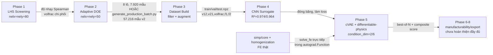
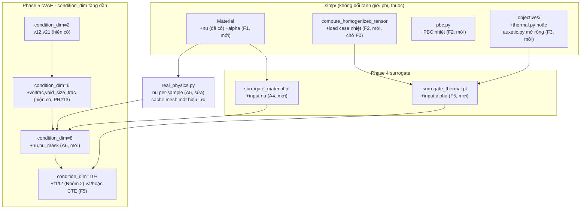

# Kiến trúc hệ thống

> Tài liệu kiến trúc: bản đồ module hiện tại, luồng dữ liệu qua 8 phase, và các điểm mở rộng mà
> roadmap [`PROJECT_PLAN.md`](PROJECT_PLAN.md) sẽ chạm vào. Phần "kiến trúc đích" ở §4 viết **trước
> khi Nhóm 1 (ν0 vật liệu nền) hoàn thành** - nhánh A1-A7 trong sơ đồ/bảng §3-4 giờ đã là code thật
> trên `main` (xem [`PROJECT_PLAN.md` Nhóm 1](PROJECT_PLAN.md#nhóm-1---giai-đoạn-a-vary-vật-liệu-nền-l-effort-lớn-nhất-ưu-tiên-cao-nhất),
> [`EXPERIMENT_LOG.md`](../EXPERIMENT_LOG.md) mục 2026-08-18/19), không còn "giả định"; chỉ nhánh F
> (nhiệt/CTE, Nhóm 6) vẫn thật sự giả định/chưa code. File `END_TO_END_SCENARIO.md` được nhắc tới ở
> §3-4 (bản nháp trước khi Nhóm 1 chạy thật) **không tồn tại** trong repo - dùng `PROJECT_PLAN.md` +
> `EXPERIMENT_LOG.md` làm nguồn thật thay thế. Không có sơ đồ nào ở đây thay thế
> [`docs/PIPELINE.md`](PIPELINE.md) (lệnh chạy + số liệu thật từng phase) hay
> [`docs/PHYSICS_AND_ML.md`](PHYSICS_AND_ML.md) (bản chất toán học) - tài liệu này chỉ tập trung vào
> **cấu trúc module và phụ thuộc giữa chúng**.

## 1. Bản đồ module hiện tại

```
simp/                           # Lõi vật lý - độc lập với pipeline/, không phụ thuộc PyTorch
├── core/                       # FE assembly, solver, PBC (real-valued, 3 load case biến dạng)
│   ├── fem.py                  #   build_dof_mesh - lưới bậc tự do
│   ├── solver.py               #   solve_fe - giải hệ tuyến tính KU=F
│   └── pbc.py                  #   build_pbc - điều kiện biên tuần hoàn (chỉ real-valued, không Bloch)
├── materials/
│   └── isotropic.py            #   Material - E0, Emin, nu (validate ở __init__), D matrix
├── homogenization/
│   └── compute.py              #   compute_homogenized_tensor - Q (3x3), dQ (3x3xnelyxnelx)
├── objectives/
│   └── auxetic.py              #   hàm mục tiêu SIMP (auxetic, v12/v21) + compute_elastic_constants (Ex,Ey,Gxy,B_eff)
├── seeds/                      #   hình dạng khởi tạo (hexagonal, hourglass, reentrant_bowtie)
└── io/                         #   đọc/ghi kết quả + reconstruct_3d_bent_surface (minh họa định tính, KHÔNG phải FE)

pipeline/                       # Orchestration 8-phase, PHỤ THUỘC simp/ (không ngược lại)
├── params.py                   #   PARAM_SPACE, FIXED_PARAMS - dùng cho Phase 1 (nelx=nely=80)
├── phase1_screening/           #   LHS sweep, phân tích độ nhạy Spearman
├── phase2_multi_batch/         #   Adaptive DOE (nelx=nely=50, ĐỘC LẬP DEFAULT_FIXED riêng)
│   ├── params.py                #   ACTIVE_PARAMETERS (production), NU_ACTIVE_PARAMETERS (Nhóm 1)
│   └── runner.py                #   DEFAULT_FIXED, build_params_dict - override theo sample_values
├── phase3_dataset/             #   scan_dataset, build_npz, finalize_dataset -> {train,val,test}.npz
├── phase4_surrogate/            #   CNN surrogate (PyTorch), đóng băng khi dùng làm loss cho Phase 5
│   ├── dataset.py, model.py, train.py, evaluate.py, export_for_phase5.py
├── phase5_cvae/                 #   Conditional VAE + differentiable-physics fine-tune
│   ├── dataset.py, model.py, train.py       #   KAN regression head (fc = EfficientKANLinear), decoder_type="conv"|"wire" (WIRE INR, Task 2), condition_dim, extended_condition, condition-dropout
│   ├── real_physics.py                       #   RealPhysicsNu (torch.autograd.Function, FE thật)
│   ├── losses.py                             #   recon + beta*kl + gamma*prop_loss (+volfrac_consistency)
│   ├── best_of_n_eval.py                     #   composite_score (0.6/0.3/0.1), oracle FE selection
│   └── sample.py                             #   inference, force_periodic() mặc định bật, --resolution (chỉ wire)

analysis/scripts/                # Script sinh dữ liệu ĐỘC LẬP với pipeline/phase2_multi_batch/
└── generate_production_batch.py #   nguồn thật của outputs/phase3/*.npz hiện tại (xem PIPELINE.md)
```

**Ranh giới phụ thuộc quan trọng (không được vi phạm khi mở rộng):**
`simp/` không import gì từ `pipeline/` hay PyTorch - đây là lớp vật lý thuần NumPy/SciPy, dùng lại
được ở cả Phase 1-3 (NumPy) lẫn Phase 5 (`real_physics.py` gọi `simp/core/solver.py` trực tiếp bên
trong `torch.autograd.Function`, không qua surrogate).

## 2. Luồng dữ liệu qua 8 phase



**Điểm khác biệt kiến trúc quan trọng ở Phase 5:** không giống Phase 1-4 (chỉ dùng surrogate/FE
NumPy tuần tự), Phase 5 có **2 đường dẫn vật lý song song**: (a) surrogate CNN đóng băng (nhanh,
nhưng từng gây "surrogate exploitation" - decoder học đánh lừa CNN); (b) `real_physics.py` (chậm
hơn nhưng chính xác - FE thật + đạo hàm giải tích ngay trong backward). Sửa tận gốc surrogate
exploitation chính là chuyển từ (a) sang (b) làm nguồn loss chính, giữ (a) chỉ để lọc sơ bộ nhanh
(`--k-fe-verify`).

## 3. Điểm mở rộng cho roadmap hiện tại

| File | Vai trò hiện tại | Điểm chạm khi mở rộng (Nhóm nào) |
|---|---|---|
| `pipeline/params.py` | `PARAM_SPACE` cho Phase 1 | A1 - đã thêm `nu` (`PARAM_SPACE['nu']=(0.2,0.4)`) |
| `pipeline/phase2_multi_batch/params.py` | `ACTIVE_PARAMETERS` cho Phase 2 | A1 - đã thêm `NU_ACTIVE_PARAMETERS` tách biệt, tránh đổi hành vi default |
| `pipeline/phase2_multi_batch/runner.py::DEFAULT_FIXED` | fallback khi sample không có cột | A1 - `nu` giữ 0.3 làm fallback, override qua `sample_values` |
| `analysis/scripts/generate_production_batch.py` | nguồn sinh dataset production thật | A3 - đã thêm `--vary-nu`, `SEED_NU_RANGE` |
| `simp/materials/isotropic.py::Material` | validate `nu` ở biên | A2 (đã có sẵn) - điểm chạm cho F1 (`alpha`) theo cùng pattern |
| `pipeline/phase4_surrogate/{dataset,model}.py` | input: ảnh + one-hot seed | A4 (thêm `nu` scalar), F5 (thêm `alpha`/CTE) |
| `pipeline/phase5_cvae/real_physics.py::RealPhysicsNu.forward` | `nu` là 1 scalar/batch | A5 - đổi thành `nu: (B,)`, **vỡ cache mesh key theo `(nelx,nely,E0,Emin,nu)`** |
| `pipeline/phase5_cvae/{dataset,model,train}.py` | `condition_dim` 2→6 (`extended_condition`) | A6 (→8), Nhóm 2 (f1/f2), F5 (CTE) - đều dùng chung pattern presence-mask + condition-dropout |
| `pipeline/phase5_cvae/model.py` | fc Linear → `EfficientKANLinear` (Task 1, đã xong); decoder conv → `decoder_type="wire"` (Task 2, code xong, chưa train) | Task 3 (ConvKAN surrogate - cùng pattern `use_kan`), Task 4 (Tandem L-BFGS - dùng `forward_coords` liên tục của WIRE decoder) |
| `simp/homogenization/compute.py::compute_homogenized_tensor` | `U` shape `(ndof,3)`, trả `Q` 3×3 | F2 - cần thêm 1 load case nhiệt, **công thức chờ F0 xác nhận trước khi đổi shape** |
| `simp/core/pbc.py` | PBC real-valued cho 3 load case biến dạng | F2 (PBC cho bài toán nhiệt); D3 nếu mở lại Nhóm 5 (PBC phức Bloch-Floquet - viết mới phần lớn) |
| `simp/objectives/auxetic.py` | mục tiêu auxetic đơn | F3 - mở rộng hoặc tách `thermal.py` cho CTE cực trị |

## 4. Kiến trúc đích (giả định, sau khi chạy hết Nhóm 1+2+6 theo kịch bản)



**Rủi ro kiến trúc lớn nhất khi đi tới kiến trúc đích:** `condition_dim` tăng tuyến tính theo số
tính chất vật lý mới (2→6→8→10+), nhưng **độ dày dữ liệu cần thiết để giữ retrieval baseline cạnh
tranh tăng theo cấp số nhân** (giả thuyết Nhóm 4.2, chưa kiểm chứng) - đây là lý do kiến trúc
"generative + differentiable-physics" được chọn thay vì tiếp tục mở rộng retrieval/tra bảng đơn
thuần. Rủi ro thứ hai là **mesh/PBC-cache trong `real_physics.py`** vốn được thiết kế cho 1 vật
liệu nền cố định (key theo `(nelx,nely,E0,Emin,nu)` - 3 tham số đầu cố định trong toàn bộ project
tới nay) - khi `nu` (và có thể `alpha`) trở thành per-sample, giả định "cache hit gần 100%" của
thiết kế gốc không còn đúng, cần đánh giá lại chi phí trước khi coi differentiable-physics fine-tune
vẫn khả thi ở quy mô hiện tại - **đã đo thật ở A5** (`EXPERIMENT_LOG.md` 2026-08-18): dựng lại
`Material` mỗi lần ~97µs/lần, ~0,1-0,2% chi phí FE-solve, rủi ro không xảy ra trong thực tế.

## 5. Quy ước đặt tên & versioning

- **Không ghi đè checkpoint** - mỗi thay đổi ý nghĩa (dataset mới, condition mới, loss mới) tạo tên
  file mới (`_v2`, `_clean`, `_extended`, `_material`, `_thermal`...), giữ bản cũ làm tham chiếu
  lịch sử có thể tái lập.
- **Cờ mặc định TẮT cho hành vi mới** - `--extended-condition`, `--vary-nu`, `--require-manufacturable`
  đều mặc định tắt để không đổi hành vi pipeline production hiện có; bật tường minh qua CLI flag.
- **Dải tham số hẹp trước, mở rộng sau khi xác nhận hội tụ** - đúng pattern đã áp dụng cho
  `volfrac`/`void_size_frac` (Phase 2 adaptive) và lặp lại cho `nu` (A3: 0,45-0,70 gốc → hẹp dần;
  `nu`: 0,2-0,4 → thu hẹp theo seed sau khi đo hội tụ thật).
- **`ACTIVE_PARAMETERS`/`PARAM_SPACE` mặc định KHÔNG đổi khi thêm tham số mới** - tham số mới luôn
  đi vào 1 dict riêng (`NU_ACTIVE_PARAMETERS`) thay vì gộp thẳng vào dict mặc định, để không âm
  thầm đổi hành vi tái tạo dataset production cũ.

## 6. Tài liệu liên quan

- [`docs/PROJECT_PLAN.md`](PROJECT_PLAN.md) - roadmap, effort, ETA, ưu tiên
- [`docs/PIPELINE.md`](PIPELINE.md) - lệnh chạy + số liệu THẬT từng phase hiện có
- [`docs/PHYSICS_AND_ML.md`](PHYSICS_AND_ML.md) - bản chất toán học/vật lý + vai trò ML
- [`docs/LIMITATIONS.md`](LIMITATIONS.md) - giới hạn đã biết, phạm vi claim khoa học
