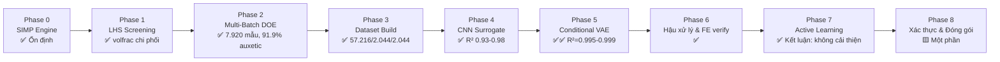
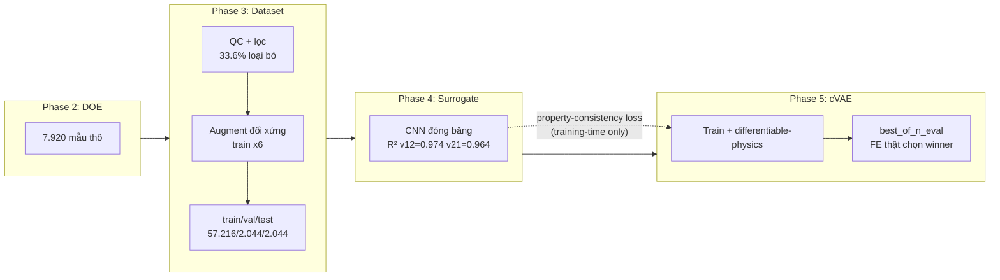
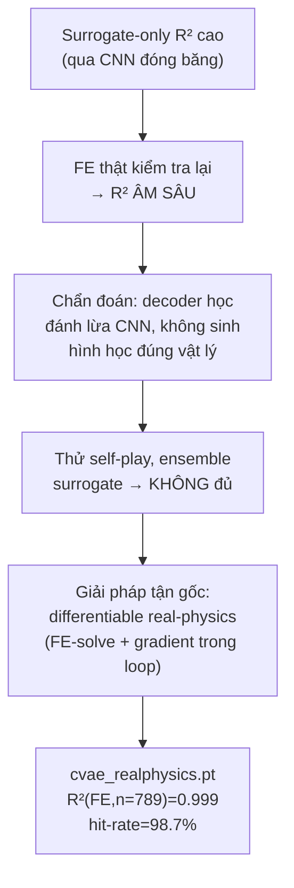

# Hướng dẫn Tạo Slide Thuyết trình & Báo cáo Khoa học (AuxForge)

> Tài liệu này hướng dẫn cách dựng **slide deck** và **science report (IMRaD)** cho dự án AuxForge, dựa trên trạng thái thực tế của pipeline tại **2026-08-05**. Nó KHÔNG lặp lại nội dung kỹ thuật đã có ở [README.md](../README.md), [docs/PIPELINE.md](PIPELINE.md), [docs/LIMITATIONS.md](LIMITATIONS.md), [docs/PHYSICS_AND_ML.md](PHYSICS_AND_ML.md) — nó nói **lấy nội dung gì từ đâu, xếp vào slide/report nào, dùng hình nào, và câu chữ nào cần thận trọng khi trình bày**.

---

## 0. Nguyên tắc bắt buộc trước khi bắt đầu

1. **Không claim vượt quá scope đã xác nhận.** Mọi slide/report PHẢI tuân theo 3 nhóm claim trong [README § Phạm vi Claim Khoa học](../README.md#phạm-vi-claim-khoa-học-đọc-trước-khi-trích-dẫn):
   - ✅ **Được ủng hộ bằng chứng** → có thể trình bày dứt khoát.
   - ⚠️ **Chưa được ủng hộ** (dù có thể đúng) → nếu nhắc tới, PHẢI gắn nhãn "chưa kiểm chứng"/"giả thuyết".
   - ❌ **Không claim** → không đưa vào slide dưới bất kỳ hình thức rút gọn nào (kể cả trong phần "kết luận" hay "future work" viết kiểu khẳng định).
2. **Mọi con số phải có cỡ mẫu (n) đi kèm.** Dự án có bài học đau: R²/hit-rate ở n=24 CI cực rộng, ở n=789 mới đáng tin ([docs/LIMITATIONS.md](LIMITATIONS.md) mục về CI). Không bao giờ ghi "R²=0.999" mà thiếu "(n=789, best-of-N oracle)".
3. **Song ngữ nhất quán.** Codebase/docs dùng tiếng Việt làm chính. Nếu report cần tiếng Anh (hội nghị quốc tế), dịch toàn bộ thuật ngữ nhất quán (glossary ở mục 5).
4. **Ngày tháng ở mọi slide/report phải ghi rõ "tính đến YYYY-MM-DD"** vì dự án cập nhật số liệu thường xuyên (xem lịch sử retrain/rebuild trong CHANGELOG.md) — slide cũ dễ lỗi thời.

---

## 1. Kiểm kê tài sản trực quan đã có sẵn (dùng lại trước khi vẽ mới)

### 1.1 Dashboard/report HTML dựng sẵn (có thể chụp màn hình hoặc nhúng trực tiếp)

| File | Nội dung | Dùng cho |
|---|---|---|
| `html/dashboards/workflow.html` | Toàn bộ workflow, chi tiết từng phase con (2.1–2.9, 3.1–3.6...) | Slide "kiến trúc pipeline chi tiết", phụ lục report |
| `html/dashboards/phase1_screening_dashboard.html` | Kết quả LHS screening Phase 1 | Slide Phase 1 / report Methods §Screening |
| `html/guides/optimization_pipeline.html` | Giải thích trực quan SIMP + OC loop | Slide giới thiệu phương pháp (background) |
| `html/guides/multi_batch_adaptive_sampling.html` | Cơ chế DOE thích ứng (Sobol → LHS tinh chỉnh) | Slide Phase 2 |
| `html/guides/simp_guide_and_roadmap.html` | SIMP 101 + roadmap 8-phase | Slide mở đầu, report Introduction |
| `html/reports/auxetic_phase1_analysis.html` | Phân tích sâu Phase 1 | Report Results §Screening |
| `html/reports/auxetic_report.html` | Báo cáo tổng hợp auxetic | Report Discussion |
| `html/reports/ml_pipeline_phase3to5.html` | Báo cáo Phase 3–5 (dataset→surrogate→cVAE) | Slide/report phần ML |

**Cách nhúng:** mở bằng trình duyệt → `Cmd/Ctrl+P` → in PDF (giữ vector), hoặc chụp riêng từng biểu đồ Canvas/SVG bằng devtools nếu cần ảnh PNG độ phân giải cao cho slide.

### 1.2 Hình PNG đã render sẵn (`outputs/figures/`)

| Thư mục | File tiêu biểu | Ý nghĩa | Slide/report nào |
|---|---|---|---|
| `convergence_analysis/` | `convergence_final_v12.png`, `convergence_volume.png`, `convergence_n_iterations.png` | Đường hội tụ ν₁₂/thể tích/số vòng lặp qua các seed | Slide "engine SIMP hoạt động đúng" / report Methods §Convergence |
| `auxetic_properties/` | `auxetic_distribution.png`, `auxetic_evolution.png`, `auxetic_v12_vs_v21.png`, `auxetic_ratio_per_seed.png` | Phân bố ν₁₂/ν₂₁, tiến triển qua các lô DOE, so sánh theo seed | Slide/report Results chính — đây là hình **quan trọng nhất** để minh họa "pipeline tạo ra auxetic thật" |
| `heatmaps/` | `heatmap_auxetic.png`, `heatmap_first.png`, `heatmap_second.png` | Bản đồ nhiệt tham số (volfrac × penal/rmin...) vs auxetic rate | Slide Phase 1 sensitivity, report Methods §Screening |
| `object_metrics/` | `image_metrics_binary_rate.png`, `image_metrics_edge_density.png`, `image_metrics_sym_lr.png` | Chất lượng ảnh nhị phân hoá (dùng cho QC dataset) | Report Methods §Dataset QC / phụ lục |
| `design_correlations/` | `barplot_importance.png`, `volcano_plot.png` | Tầm quan trọng tham số (Spearman r), volcano plot ý nghĩa thống kê | Slide Phase 1 "volfrac là tham số chi phối (r≈0,87–0,96)" |

### 1.3 Notebook (chạy lại để tạo hình cập nhật nếu số liệu đã đổi)

`notebooks/01_data_loading_and_quality_control.ipynb` → `06_phase1_to_phase5_pipeline_summary.ipynb` — notebook 06 là **tổng kết end-to-end**, ưu tiên chạy lại notebook này trước khi làm slide/report tổng quan, vì các hình ở mục 1.2 có thể chưa phản ánh dataset v2 (57.216 mẫu) hoặc backfill f1/f2 (2026-08-05).

⚠️ **Kiểm tra trước khi dùng:** nhiều hình ở `outputs/figures/` được tạo từ các lần chạy cũ hơn dataset v2/rebuild dQ. Trước khi đưa vào slide chính thức, xác nhận ngày sinh file (`ls -la`) so với các mốc cập nhật số liệu trong CHANGELOG.md — nếu cũ hơn 2026-07-24 (rebuild dQ) hoặc 2026-07-25 (dataset v2), nên chạy lại script/notebook tương ứng.

---

## 2. Sơ đồ cần vẽ mới (chưa có sẵn, tự dựng bằng Mermaid/PowerPoint)

Các sơ đồ này KHÔNG tồn tại sẵn trong repo — dựng bằng Mermaid (paste vào artifact/Markdown render) hoặc PowerPoint SmartArt.

### 2.1 Sơ đồ tổng quan pipeline 8-phase (slide mở đầu)



### 2.2 Sơ đồ vòng lặp SIMP (cho phần background/methods)

```mermaid
flowchart TD
    A[Seed Generation] --> B[FE Analysis]
    B --> C[Homogenization<br/>U_total = U0 + χ]
    C --> D[Objective & Sensitivity<br/>c = Q12 - μ·(Q11+Q22)]
    D --> E[Density/Sensitivity Filtering]
    E --> F[OC Update]
    F --> G{Hội tụ?<br/>Δdesign / Δobj / max_iter}
    G -- Chưa --> B
    G -- Rồi --> H[Kết thúc: xPhys, Q, ν12/ν21]
```

### 2.3 Sơ đồ vòng đời dữ liệu → mô hình (cho phần ML)



### 2.4 Sơ đồ "vòng đời khắc phục surrogate exploitation" (câu chuyện khoa học hay nhất của dự án — nên có slide riêng)



> Đây là điểm nhấn khoa học tốt nhất để trình bày: một thất bại (metric giả) → chẩn đoán đúng nguyên nhân → 2 giải pháp thử-sai không đủ → giải pháp tận gốc có bằng chứng ở n lớn. Xem chi tiết đầy đủ ở `EXPERIMENT_LOG.md`.

Công cụ dựng: dùng Artifact (mermaid native) để preview nhanh, hoặc paste mã Mermaid vào [mermaid.live](https://mermaid.live) rồi export SVG/PNG cho PowerPoint/Google Slides (PowerPoint không render Mermaid trực tiếp).

---

## 3. Outline Slide Deck (14 slide, ~15-18 phút)

Bản rút gọn — mỗi slide dưới đây gộp 1-3 slide của bản đầy đủ trước đó để giữ dưới 15 slide mà không cắt nội dung bắt buộc (claim scope, surrogate exploitation).

| # | Slide | Nội dung (gộp) | Nguồn |
|---|---|---|---|
| 1 | Bìa | Tên dự án, tác giả, ngày, phiên bản (v1.4.0) | README badge |
| 2 | Motivation & Bài toán | Vật liệu auxetic là gì + ứng dụng; inverse design: cho ν mục tiêu → sinh hình học | docs/PHYSICS_AND_ML.md §1; README Tổng quan |
| 3 | Kiến trúc tổng thể | Sơ đồ 2.1 (8-phase) | Mục 2.1 |
| 4 | SIMP cơ bản & 11 seed | Sơ đồ 2.2 + công thức mục tiêu; bảng seed + tỷ lệ auxetic (93.8% circle → 48.6% reentrant_bowtie) | docs/PHYSICS_AND_ML.md §2-4; README bảng "Các Seed Có sẵn" |
| 5 | Phase 1 — Screening | `barplot_importance.png`, `volcano_plot.png` — volfrac chi phối (r≈0.87-0.96) | outputs/figures/design_correlations/ |
| 6 | Phase 2 — Adaptive DOE | Bảng 8 lô (Sobol→LHS), auxetic rate 74.9%→87.8%; phát hiện SEED (không phải tham số liên tục) chi phối manufacturability + rebuild dQ (82.1%→91.9%) | docs/PIPELINE.md §2; EXPERIMENT_LOG.md |
| 7 | Phase 3 — Dataset | QC pipeline, 33.6% loại bỏ, augment đối xứng, split 57.216/2.044/2.044 | docs/PIPELINE.md §3 |
| 8 | Phase 4 — CNN Surrogate | Kiến trúc 4×Conv-BN-ReLU-Pool, bảng R² (v12=0.974, v21=0.964, volfrac=0.983) + CI | docs/PIPELINE.md §4 |
| 9 | Phase 5 — cVAE & Surrogate Exploitation | Kiến trúc cVAE; sơ đồ 2.4 — **highlight khoa học chính**: metric giả qua surrogate → chẩn đoán → differentiable real-physics | docs/PHYSICS_AND_ML.md §6.2-6.3; Mục 2.4 |
| 10 | Phase 5 — Kết quả & mở rộng | Bảng so sánh checkpoint (R², hit-rate, manufacturability); optional multi-condition (condition_dim 2→6, composite scoring 0.6/0.3/0.1) | docs/PIPELINE.md §5, §5.1 |
| 11 | Phase 6-8 — Hậu xử lý & xác thực | manufacturability filter, đối chiếu scikit-fem (R²=1.000000), thư viện 24 thiết kế (hit-rate 100%) | README bảng trạng thái hàng 6-8 |
| 12 | **Phạm vi claim khoa học** (bắt buộc, không được bỏ) | 3 nhóm claim (được/chưa/không) | README §Phạm vi Claim Khoa học |
| 13 | Giới hạn & hướng tiếp theo | Top giới hạn (mu tắt, f1/f2 chưa nối condition, CI rộng ở n nhỏ, FEM tuyến tính); pilot chưa production (reentrant_bowtie 46%→76-80%, N=400, Wilson CI); ưu tiên tiếp theo (large-strain/commercial FE, f1/f2→cVAE, mu redesign, connectivity filter) | docs/LIMITATIONS.md; `outputs/pilot_damping_decay/PILOT_REPORT.md`; project memory `project_priority_2026-08-04` |
| 14 | Tham khảo & Q&A | Sigmund 2001, Andreassen 2011, Xia & Breitkopf 2015, Pahlavani 2024, Lakshminarayanan 2017 | README §Tài liệu Tham khảo |

**Mẹo trình bày:** slide 9 (surrogate exploitation) và slide 12 (phạm vi claim) là hai slide dễ bị đọc lướt nhất nhưng chứng minh tính nghiêm túc khoa học của dự án nhất — người phản biện sẽ hỏi đúng 2 điều này trước, dành thời gian nói kỹ hơn cho 2 slide này dù tổng deck đã rút gọn.

---

## 4. Outline Science Report (IMRaD, ~12-20 trang)

### 4.1 Title & Abstract
- Abstract PHẢI có số liệu định lượng + cỡ mẫu, ví dụ: *"...checkpoint cVAE hiện tại đạt R²(FE, n=789)=0.999 (oracle) và hit-rate single-shot 98.7%..."* — không viết mơ hồ ("hiệu năng cao").

### 4.2 Introduction
- Bối cảnh vật liệu auxetic + inverse design (docs/PHYSICS_AND_ML.md §1, §5).
- Gap: các nghiên cứu trước dùng surrogate-only eval dễ bị exploitation (liên hệ Pahlavani 2024 — nguồn cảm hứng cho best-of-N).
- Đóng góp của dự án (bullet, khớp với README §Phạm vi Claim Khoa học nhóm "được ủng hộ").

### 4.3 Methods
1. **SIMP Engine** — công thức mục tiêu, PBC, homogenization (docs/PHYSICS_AND_ML.md §2-4). Sơ đồ 2.2.
2. **Seed geometries** — bảng 11 seed.
3. **Phase 1-2: DOE** — LHS + adaptive Sobol/LHS, thuật toán quyết định refine/expand/stop.
4. **Phase 3: Dataset construction** — QC, filtering criteria, augmentation, split strategy (chống rò rỉ theo seed).
5. **Phase 4: CNN Surrogate** — kiến trúc, loss, mục đích (differentiable proxy tốc độ cao).
6. **Phase 5: Conditional VAE** — kiến trúc, loss (`recon + beta·kl + gamma·prop_loss`), differentiable real-physics prior loss (công thức + chi phí tính toán ~50-100ms/mẫu).
7. **Evaluation protocol: best-of-N** — giải thích rõ vì sao FE thật (không phải surrogate) là trọng tài cuối; nêu rõ 2 chế độ oracle vs K-filtered.
8. **Statistical methodology** — bootstrap percentile CI (`bootstrap_ci.py`), cỡ mẫu cho từng phép đo (n=1.184 test Phase 4, n=789/300/24 tùy thí nghiệm Phase 5) — bảng tổng hợp cỡ mẫu là **bắt buộc** để độc giả tự đánh giá độ tin cậy.

### 4.4 Results
- Bảng số liệu chính (copy nguyên từ docs/PIPELINE.md, GIỮ NGUYÊN CI, không làm tròn thêm).
- Hình `auxetic_evolution.png`, `auxetic_distribution.png` minh họa tiến triển qua 8 lô DOE.
- Bảng so sánh checkpoint (`cvae_v2_finetuned.pt` vs `cvae_realphysics.pt`).
- Kết quả đối chiếu độc lập scikit-fem (R²=1.000000, n=24) — bằng chứng đúng vật lý, nên tách thành sub-section riêng vì đây là claim mạnh nhất của dự án.
- Kết quả OOD baseline (sign-flip: cVAE R²=0.42 vs retrieval R²=0.06, n=12) — trình bày kèm cảnh báo n nhỏ, KHÔNG suy rộng.

### 4.5 Discussion
- Diễn giải câu chuyện surrogate exploitation như một đóng góp phương pháp luận (không chỉ là bug fix).
- So sánh trực tiếp với 3 nhóm claim (được/chưa/không) — đây nên là đoạn văn xuôi tương ứng slide 17.
- Thảo luận toàn bộ 18 mục Giới hạn Đã biết theo nhóm chủ đề (dữ liệu / mô hình / đánh giá / vật lý) thay vì liệt kê rời rạc — xem docs/LIMITATIONS.md để phân nhóm.

### 4.6 Conclusion & Future Work
- Kết luận đúng scope (không quá đà).
- Future work: Group 1 (large-strain FEM, đối chiếu FE thương mại) + Group 2 (nối f1/f2 vào condition Phase 5, thiết kế lại mu penalty sau khi biến thể normalized bị loại 2026-08-05, cải thiện yield hexagonal/reentrant_bowtie, connectivity filter) — lấy đúng từ ưu tiên phiên làm việc gần nhất, không tự bịa hướng mới.

### 4.7 References
- Copy nguyên từ README §Tài liệu Tham khảo, giữ định dạng DOI.

### 4.8 Appendix (khuyến nghị)
- Bảng đầy đủ 11 seed × auxetic rate.
- Bảng đầy đủ 8 lô DOE.
- Lịch sử checkpoint (gamma20 → clean_weighted → realphysics → v2_finetuned) để người đọc thấy tính lặp lại của quá trình cải tiến.

---

## 5. Glossary song ngữ (dùng nếu report/slide tiếng Anh)

| Tiếng Việt | English |
|---|---|
| Tối ưu hóa topology | Topology optimization |
| Vật liệu auxetic (hệ số Poisson âm) | Auxetic material (negative Poisson's ratio) |
| Ô đơn vị tuần hoàn | Periodic unit cell |
| Đồng nhất hóa dựa trên năng lượng | Energy-based homogenization |
| Điều kiện biên tuần hoàn (PBC) | Periodic boundary conditions |
| Thiết kế ngược | Inverse design |
| Mô hình sinh có điều kiện (cVAE) | Conditional generative model (cVAE) |
| Surrogate đóng băng | Frozen surrogate |
| Đánh lừa surrogate | Surrogate exploitation |
| Vật lý khả vi | Differentiable physics |
| Khả năng chế tạo | Manufacturability |
| Tỷ lệ trúng đơn phát | Single-shot hit rate |
| Chọn tốt nhất trong N | Best-of-N selection |
| Khoảng tin cậy bootstrap | Bootstrap confidence interval |

---

## 6. Checklist trước khi công bố slide/report

- [ ] Mọi số liệu đều có cỡ mẫu (n=...) đi kèm.
- [ ] Đã kiểm tra ngày tạo hình trong `outputs/figures/` so với mốc cập nhật dataset (2026-07-24 rebuild dQ, 2026-07-25 dataset v2, 2026-08-05 backfill f1/f2) — không dùng hình lỗi thời làm số liệu chính.
- [ ] Slide/report có mục "Phạm vi Claim Khoa học" riêng, không trộn lẫn 3 nhóm claim.
- [ ] Không có câu nào thuộc nhóm "Không claim" (README) xuất hiện dưới dạng khẳng định, kể cả gián tiếp trong phần kết luận.
- [ ] Đã trích dẫn đúng 5 tài liệu tham khảo trong README nếu dùng phương pháp/ý tưởng liên quan (best-of-N ← Pahlavani 2024; ensemble uncertainty ← Lakshminarayanan 2017).
- [ ] Checkpoint được nhắc tới (`cvae_v2_finetuned.pt`/`cvae_realphysics.pt`) khớp với checkpoint khuyến nghị hiện hành trong README (không dùng `cvae_gamma20.pt`/`cvae_clean_weighted.pt` làm số liệu chính — đó là baseline lịch sử).
- [ ] Đã đối chiếu số liệu report với `docs/PIPELINE.md` và `README.md` bản mới nhất trước khi khóa bản in cuối — hai file này là nguồn số liệu chính thức, ưu tiên hơn số liệu trong đầu.
